# 🏗️ Kubs Microservices Architecture

## 📊 **System Overview**

```mermaid
graph TB
    subgraph "External Access"
        USER[👤 User]
        API[🌐 API Client]
    end
    
    subgraph "Kubernetes Cluster (Minikube)"
        subgraph "Ingress Layer"
            NGINX[🔀 Nginx Ingress Controller]
        end
        
        subgraph "Application Services"
            SUBMITTER[📝 Submitter Service<br/>Port: 3000<br/>Type: ClusterIP]
            WORKER1[⚙️ Worker Pod 1<br/>Port: 3001]
            WORKER2[⚙️ Worker Pod 2<br/>Port: 3001]
            WORKERN[⚙️ Worker Pod N<br/>Port: 3001<br/>HPA: 2-10 replicas]
            STATS[📊 Stats Service<br/>Port: 3002<br/>Type: ClusterIP]
        end
        
        subgraph "Data Layer"
            REDIS[🔴 Redis<br/>Port: 6379<br/>Type: ClusterIP]
        end
        
        subgraph "Monitoring Stack"
            PROMETHEUS[📈 Prometheus<br/>Port: 9090<br/>Type: ClusterIP]
            GRAFANA[📊 Grafana<br/>Port: 3000<br/>Type: ClusterIP]
            ALERTMANAGER[🚨 AlertManager<br/>Port: 9093<br/>Type: ClusterIP]
        end
    end
    
    %% External connections
    USER --> NGINX
    API --> NGINX
    NGINX --> SUBMITTER
    
    %% Internal service connections
    SUBMITTER --> REDIS
    WORKER1 --> REDIS
    WORKER2 --> REDIS
    WORKERN --> REDIS
    STATS --> REDIS
    STATS --> SUBMITTER
    STATS --> WORKER1
    STATS --> WORKER2
    STATS --> WORKERN
    
    %% Monitoring connections
    PROMETHEUS --> WORKER1
    PROMETHEUS --> WORKER2
    PROMETHEUS --> WORKERN
    PROMETHEUS --> STATS
    PROMETHEUS --> GRAFANA
    PROMETHEUS --> ALERTMANAGER
    
    %% Styling
    classDef external fill:#e1f5fe
    classDef ingress fill:#fff3e0
    classDef app fill:#f3e5f5
    classDef data fill:#ffebee
    classDef monitoring fill:#e8f5e8
    
    class USER,API external
    class NGINX ingress
    class SUBMITTER,WORKER1,WORKER2,WORKERN,STATS app
    class REDIS data
    class PROMETHEUS,GRAFANA,ALERTMANAGER monitoring
```



## 🔄 **Service Communication Flow**


## 🏗️ **Kubernetes Architecture Details**

### **Namespaces**
- **`default`**: Application services (submitter, worker, stats, redis)
- **`monitoring`**: Monitoring stack (prometheus, grafana, alertmanager)
- **`ingress-nginx`**: Nginx ingress controller

### **Service Types**
- **ClusterIP**: Internal services (worker, stats, redis, monitoring)
- **Ingress**: External access (submitter via nginx)

### **Deployment Strategies**
- **Submitter**: Single replica (stateless)
- **Worker**: HPA 2-10 replicas (CPU-based scaling)
- **Stats**: Single replica (aggregation service)
- **Redis**: Single replica with PVC (stateful)
- **Monitoring**: Helm-managed (high availability)

## 📊 **Monitoring Architecture**


## 🔧 **Deployment Commands**

### **Complete Deployment**
```bash
# Deploy everything
./scripts/deploy-all.sh

# Or deploy separately
./scripts/deploy.sh          # Application services
./scripts/deploy-monitoring.sh  # Monitoring stack
```

### **Access Services**
```bash
# Access monitoring
./scripts/access-monitoring.sh

# Access application
minikube service ingress-nginx-controller -n ingress-nginx --url
```

### **Cleanup**
```bash
./scripts/cleanup.sh          # Application services
./scripts/cleanup-monitoring.sh  # Monitoring stack
```

## 📈 **Key Features**

### **High Availability**
- **HPA**: Worker pods scale 2-10 based on CPU
- **Health Checks**: Liveness and readiness probes
- **Service Discovery**: Kubernetes DNS-based communication

### **Monitoring & Observability**
- **Metrics**: Prometheus scrapes all services
- **Dashboards**: Grafana with custom kubs dashboard
- **Alerting**: AlertManager for critical issues
- **Logging**: Centralized logging via kubectl logs

### **Security**
- **Network Policies**: Services communicate internally
- **RBAC**: Proper permissions for monitoring
- **Secrets**: Grafana admin credentials secured

### **Scalability**
- **Horizontal Scaling**: HPA for worker pods
- **Resource Limits**: CPU and memory constraints
- **Persistent Storage**: Redis data persistence

## 🌐 **Network Architecture**


## 🎯 **Service Responsibilities**

| Service | Responsibility | Port | Type | Scaling |
|---------|---------------|------|------|---------|
| **Submitter** | Job submission API | 3000 | ClusterIP | 1 replica |
| **Worker** | Job processing | 3001 | ClusterIP | 2-10 (HPA) |
| **Stats** | Metrics aggregation | 3002 | ClusterIP | 1 replica |
| **Redis** | Job queue storage | 6379 | ClusterIP | 1 replica |
| **Prometheus** | Metrics collection | 9090 | ClusterIP | 1 replica |
| **Grafana** | Metrics visualization | 3000 | ClusterIP | 1 replica |

## 🔍 **Monitoring Metrics**

### **Application Metrics**
- `jobs_processed_total` - Total jobs processed
- `job_errors_total` - Total job errors
- `job_processing_time_seconds` - Processing time histogram
- `total_jobs_submitted` - Jobs submitted to system
- `total_jobs_completed` - Jobs completed successfully
- `total_jobs_failed` - Jobs that failed
- `queue_length` - Current queue length

### **System Metrics**
- `up` - Service availability
- `process_cpu_seconds_total` - CPU usage
- `process_resident_memory_bytes` - Memory usage
- `nodejs_eventloop_lag_seconds` - Event loop lag

---

*This architecture provides a robust, scalable, and observable microservices platform for job processing with comprehensive monitoring capabilities.*
